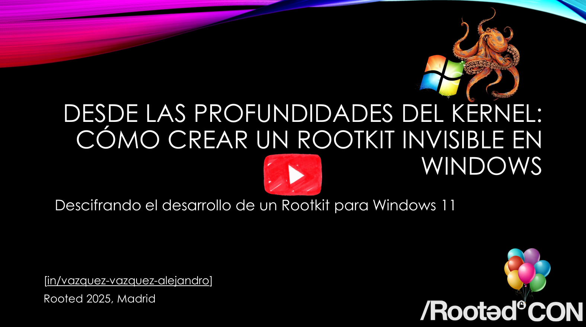

# 🏴‍☠️ Bentico: Windows Kernel Rootkit

	

---
---
---

## 📑 Table of Contents

* [Overview](#overview)
* [What is a Rootkit?](#whatisarootkit)
* [Windows Kernel](#windowskernel)
* [Security Measures](#windowssecuritymeasures)
* [Building a Windows Kernel Mode Driver](#buildingawindowskernelmodedriver)
* [Bentico Windows Rootkit](#benticowindowsrootkit)
* [Cybersecurity Conferences](#cybersecurityconferences)
* [Resources](#resources)
* [Contact](#contact)

---
---
---

## 🗒️ Overview

Bentico (Benthic) is a comprehensive project thoroughly designed with the explicit goal of establishing a robust foundation for the development of rootkits. By offering a centralized repository of knowledge, Bentico stands as a valuable initiative for anyone looking to contribute to and benefit from the collective understanding of this field. However, it is imperative to underscore that Bentico is not a tool intended for malicious purposes; rather, it is a carefully constructed initiative for educational exploration and practical insights.

Bentico's significance extends beyond its basic functionality within Windows environments; it serves as a gateway for individuals venturing into the intricate and advanced field of rootkit development.

---
---
---

## 🐙 What is a Rootkit?

"A Rootkit is a collection of software designed to give malicious actors control of a computer network or application. Once activated, the malicious program sets up a backdoor exploit and may deliver additional malware, such as ransomware, bots, keyloggers or trojans. Rootkits may remain in place for years because they are hard to detect, due in part to their ability to block some antivirus software and malware scanner software. Known rootkits can be classified into a few broad families, although there are many hybrids as well. One of the most well-known types is the kernel mode rootkit (complicated to create), a sophisticated piece of malware that can add new code to the operating system or delete and edit operating system code." ~ [CrowdStrike](https://www.crowdstrike.com/cybersecurity-101/malware/rootkits/)

Essentially, a rootkit is a form of malicious software strategically designed to target a computer's operating system while hiding its presence and activities from users and security solutions.

In the case of Bentico, this manifests as a specialized focus on the complexities inherent in developing Windows kernel mode drivers.

---
---
---

## 🪟 Windows Kernel

The [Windows Kernel](https://learn.microsoft.com/en-us/windows-hardware/drivers/ddi/_kernel/) is the core of the Windows operating system, responsible for managing hardware, memory, processes, and security at the lowest level. It operates in Ring 0 (privileged mode), allowing direct interaction with system resources.

### 🔍 Key Responsibilities of the Windows Kernel
- Process and Thread Management: Handles process scheduling, thread execution, and synchronization mechanisms.
- Memory Management: Manages virtual memory, paging, and address translation.
- Device and Driver Communication: Provides APIs for Kernel Mode Drivers (KMDF/UMDF) to interact with hardware.
- Security and Access Control: Implements User Mode vs Kernel Mode separation to enforce system integrity.
- I/O Management: Handles file systems, networking, and system services.

### ⚡ Kernel Mode vs User Mode
| Feature              | User Mode                 | Kernel Mode                     |
|----------------------|---------------------------|---------------------------------|
|    Access Level      | Restricted (Ring 3)       | Full System Access (Ring 0)     |
|    Performance       | Lower (API abstraction)   | Higher (Direct hardware access) |
|    Security          | Isolated from the OS core | Runs with full privileges       |
|    Crash Impact      | Affects only the process  | Can crash the entire system     |

### 🛠️ Why Develop Kernel Mode Drivers?

Kernel Mode development is essential for:

- Developing custom drivers for new hardware or virtualization.
- Implementing security tools such as anti-cheat engines, endpoint security solutions, and forensic tools.
- Manipulating system behavior for research or rootkit development.

⚠️ *Kernel development requires careful implementation to avoid system crashes, privilege escalation vulnerabilities, and performance issues.*

---
---
---

## 🛡️ Security Measures

* **Secure Boot (Anti-Bootkit Installation)**: [Secure Boot](https://learn.microsoft.com/en-us/windows-hardware/design/device-experiences/oem-secure-boot) is a security feature that ensures a device boots using software trusted by the manufacturer. It verifies the digital signature of the boot loaders to prevent unauthorized applications from running during the boot process. Secure Boot uses a set of keys (PK, KEK, db, dbx) to manage this verification process, allowing only signed software to execute.
* **Early Launch AntiMalware - ELAM (Anti-Rootkit Installation)**: The [Early Launch AntiMalware](https://learn.microsoft.com/en-us/windows-hardware/drivers/install/early-launch-antimalware) feature allows anti-malware software to start before all other drivers. This early start ensures that the anti-malware software can check and verify the integrity of startup drivers and services, helping to prevent malware from executing at the earliest possible point in the boot process.
* **Driver Signature Enforcement - DSE (Anti-Rootkit Installation)**: [Driver Signature Enforcement](https://learn.microsoft.com/en-us/windows-hardware/drivers/install/driver-signing) is a security feature that ensures only drivers signed by a trusted authority can be loaded into the Windows operating system. This helps prevent the installation of drivers that could be malicious or unstable, thereby maintaining system integrity and stability.
* **Driver Blocklist for Vulnerable Drivers - (Anti-Rootkit Installation via BYOVD)** - [Driver Blocklist](https://learn.microsoft.com/en-us/windows/security/application-security/application-control/app-control-for-business/design/microsoft-recommended-driver-block-rules) prevents the loading of known vulnerable drivers exploited in [BYOVD](https://blogs.vmware.com/security/2023/04/bring-your-own-backdoor-how-vulnerable-drivers-let-hackers-in.html) (Bring Your Own Vulnerable Driver) attacks. This feature ensures system integrity by blocking outdated or compromised drivers, even if signed, using technologies like HVCI and WDAC, providing an additional layer of kernel-level security.
* **Kernel Patch Protection - Patchguard (Anti-Rootkit Deep Funcionalities)**: Kernel Patch Protection, also known as Patchguard, is a feature in 64-bit versions of Windows that prevents unauthorized modification of the Windows kernel. This security measure helps protect the kernel from rootkits and other forms of malware that attempt to insert malicious code into the kernel space.
* **Virtualization Based Security - VBS (Global)** - [Virtualization Based Security](https://learn.microsoft.com/en-us/windows-hardware/design/device-experiences/oem-vbs) uses hardware virtualization features to create and isolate a secure region of memory from the normal operating system. VBS can help protect Windows from vulnerabilities in the operating system and from malicious software that attempts to tamper with the kernel and system processes. This secure environment is used to host several security solutions, such as [Credential Guard](https://learn.microsoft.com/en-us/windows/security/identity-protection/credential-guard/), providing enhanced protection against advanced security threats.

---
---
---

## 🧑‍💻 Building a Windows Kernel Mode Driver

### 🛠️ Requirements

To set up the necessary environment for Kernel Mode drivers development using WDK on [Windows](https://github.com/tianocore/tianocore.github.io/wiki/Windows-systems), the following virtual machines (VMs), tools, and packages are essential:

* **Machines**: Download a [Windows 10](https://www.microsoft.com/en-us/software-download/windows10) or [Windows 11](https://www.microsoft.com/en-us/software-download/windows11) ISO image and set up a virtual machine using [VirtualBox](https://www.virtualbox.org/) or [VMware Workstation](https://www.vmware.com/products/desktop-hypervisor/workstation-and-fusion), configuring it with 70 GB of storage and 8 gigabytes of RAM.
* **Visual Studio 2022 Community**: Download [Visual Studio 2022 Community](https://visualstudio.microsoft.com/thank-you-downloading-visual-studio/?sku=Community&channel=Release&version=VS2022) and, before installing, make sure to select the "[Desktop development with C++](https://learn.microsoft.com/en-us/cpp/build/vscpp-step-0-installation?view=msvc-160)" workload and the 'MSVC v143 - VS 2022 C++ x64/x86 Spectre-mitigated libs (latest)' individual component.
* **Git**: Install [Git](https://git-scm.com/) by downloading the appropriate [binary](https://git-scm.com/download/win).
* **Windows Software Development Kit (SDK)**: Install [SDK](https://developer.microsoft.com/en-us/windows/downloads/windows-sdk/).
* **Windows Driver Kit (WDK)**: Install [WDK](https://learn.microsoft.com/en-us/windows-hardware/drivers/download-the-wdk) and select 'Windows Driver Kit Visual Studio extension' to complete the integration with Visual Studio.

### 📜 Script

To simplify the process of establishing a Rootkit development environment on Windows, a corresponding PowerShell script [Setup_Development_Environment.ps1](https://github.com/TheMalwareGuardian/Bootkits-Rootkits-Development-Environment/blob/main/Scripts/Setup_Development_Environment_Windows.ps1) has been created. This script is designed to walk you through the necessary downloads and installations.

	

### 🏗️ Project Setup

To start developing a Kernel Mode Driver, follow these steps to create your project and workspace:

1. Open Visual Studio and click on 'Create a new project'.
2. Search for and select the 'Kernel Mode Driver, Empty (KMDF)' template.
3. Name your project (e.g., MyKernelDriver) and specify the location for your workspace.
4. Once the project is created, configure your build environment by setting the appropriate dependencies and include paths for the Windows Driver Kit (WDK). Ensure that your target platform and configurations (e.g., Debug/Release, x64/x86) are correctly selected.

---
---
---

## 🦠 Bentico Windows Rootkit

As I mentioned during my talk at RootedCON Madrid 2025, I will be releasing the full rootkit in a few months, but first, I want my students to have exclusive access throughout this academic year before making it publicly available.

You already have the foundation and most of the rootkit's functionalities available separately in the rootkits folder, so with the extensive resources provided, you can develop your own version. With the talk I gave and the repositories I've shared, you have everything you need to make it happen, and even improve it.

That's ultimately my goal - bringing this complex field closer to you 😊.

---
---
---

## 🎙️ Cybersecurity Conferences

📁 You can find all materials related to these events (slides, demos, extra resources) in the [`Cybersecurity Conferences`](https://github.com/TheMalwareGuardian/Bentico/tree/main/Cybersecurity%20Conferences) folder of this repository.

* ***[Youtube Video - RootedCON Madrid 2025](https://www.youtube.com/watch?v=W7jj1e30ADU)***: From Deep Within the Kernel: How to Build an Invisible Rootkit on Windows [ES]

  
   
  <em>Spanish Version – Desde las Profundidades del Kernel: Cómo Crear un Rootkit Invisible en Windows</em>

* ***ViCONgal 2025*** *(incoming)*: Confirmed participation with a new session on advanced malware development.

---
---
---

## 🏴‍☠️ Resources

📌 ***[TheMalwareGuardian: Awesome Bootkit & Rootkit Development Resources](https://github.com/TheMalwareGuardian/Awesome-Bootkits-Rootkits-Development)***: My compilation (+300) of extensive resources dedicated to bootkit and rootkit development.

---
---
---

## 📬 Contact

This project represents a dedicated exploration into the intricate realm of rootkits, with a specific focus on providing a comprehensive resource for both my students and individuals embarking on their journey in this complex field.

The subject of rootkits is multifaceted, and this project serves as a starting point for understanding its nuances. It's important to acknowledge that certain aspects may assume a level of prior knowledge, while others may remain uncharted due to the inherent complexities of the subject matter.

This work is designed to offer valuable insights and resources to support your educational and developmental goals, making it suitable for anyone seeking to delve into rootkit development. If you have specific inquiries, require additional clarification, or wish to engage in collaborative efforts, please do not hesitate to get in [touch](https://www.linkedin.com/in/vazquez-vazquez-alejandro/).
