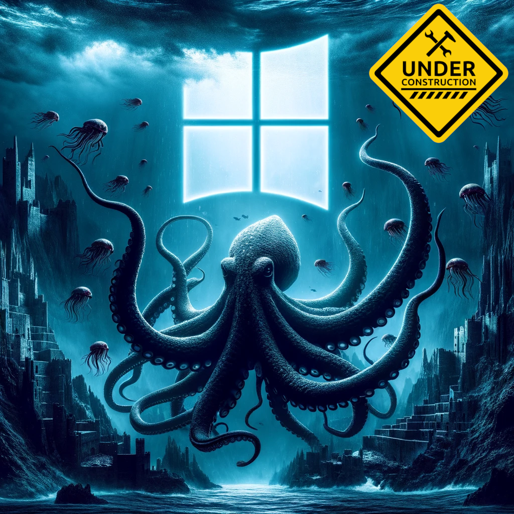

  

## Overview

Bentico is a comprehensive project thoroughly designed with the explicit goal of establishing a robust foundation for the development of rootkits. By offering a centralized repository of knowledge, Bentico stands as a valuable initiative for anyone looking to contribute to and benefit from the collective understanding of this field. However, it is imperative to underscore that Bentico is not a tool intended for malicious purposes; rather, it is a carefully constructed initiative for educational exploration and practical insights.

Bentico's significance extends beyond its basic functionality within Windows environments; it serves as a gateway for individuals venturing into the intricate and advanced field of rootkit development.

## What is a Rootkit?

"A Rootkit is a collection of software designed to give malicious actors control of a computer network or application. Once activated, the malicious program sets up a backdoor exploit and may deliver additional malware, such as ransomware, bots, keyloggers or trojans. Rootkits may remain in place for years because they are hard to detect, due in part to their ability to block some antivirus software and malware scanner software. Known rootkits can be classified into a few broad families, although there are many hybrids as well. One of the most well-known types is the kernel mode rootkit (complicated to create), a sophisticated piece of malware that can add new code to the operating system or delete and edit operating system code." ~ [CrowdStrike](https://www.crowdstrike.com/cybersecurity-101/malware/rootkits/)

Essentially, a rootkit is a form of malicious software strategically designed to target a computer's operating system while hiding its presence and activities from users and security solutions.

In the case of Bentico, this manifests as a specialized focus on the complexities inherent in developing kernel mode Windows drivers.

## Contact

This project represents a dedicated exploration into the intricate realm of rootkits, with a specific focus on providing a comprehensive resource for both my students and individuals embarking on their journey in this complex field.

The subject of rootkits is multifaceted, and this project serves as a starting point for understanding its nuances. It's important to acknowledge that certain aspects may assume a level of prior knowledge, while others may remain uncharted due to the inherent complexities of the subject matter.

This work is designed to offer valuable insights and resources to support your educational and developmental goals, making it suitable for anyone seeking to delve into rootkit development. If you have specific inquiries, require additional clarification, or wish to engage in collaborative efforts, please do not hesitate to get in [touch](https://www.linkedin.com/in/vazquez-vazquez-alejandro/).

## License

This project is licensed under the GNU GLPv3 License - see the [LICENSE](LICENSE) file for details.
