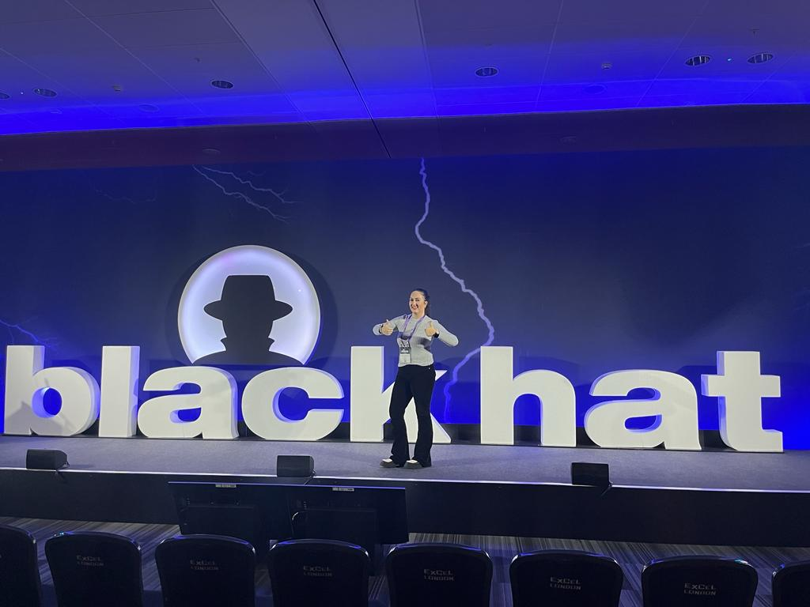

# ***🏴‍☠️ Benthic: Windows Kernel Rootkit***

	

---
---
---

## ***📑 Table of Contents***

* [Overview](#overview)
* [What is a Rootkit?](#whatisarootkit)
* [Benthic Windows Rootkit](#benthicindowsrootkit)
* [Cybersecurity Conferences](#cybersecurityconferences)
* [Resources](#resources)
* [Contact](#contact)

---
---
---

## ***🗒️ Overview***

Benthic (Bentico) is a comprehensive project thoroughly designed with the explicit goal of establishing a robust foundation for the development of rootkits. By offering a centralized repository of knowledge, Benthic stands as a valuable initiative for anyone looking to contribute to and benefit from the collective understanding of this field. However, it is imperative to underscore that Benthic is not a tool intended for malicious purposes; rather, it is a carefully constructed initiative for educational exploration and practical insights.

Benthic's significance extends beyond its basic functionality within Windows environments; it serves as a gateway for individuals venturing into the intricate and advanced field of rootkit development.

---
---
---

## 🐙 What is a Rootkit?

"A Rootkit is a collection of software designed to give malicious actors control of a computer network or application. Once activated, the malicious program sets up a backdoor exploit and may deliver additional malware, such as ransomware, bots, keyloggers or trojans. Rootkits may remain in place for years because they are hard to detect, due in part to their ability to block some antivirus software and malware scanner software. Known rootkits can be classified into a few broad families, although there are many hybrids as well. One of the most well-known types is the kernel mode rootkit (complicated to create), a sophisticated piece of malware that can add new code to the operating system or delete and edit operating system code." ~ [CrowdStrike](https://www.crowdstrike.com/cybersecurity-101/malware/rootkits/)

Essentially, a rootkit is a form of malicious software strategically designed to target a computer's operating system while hiding its presence and activities from users and security solutions.

In the case of Benthic, this manifests as a specialized focus on the complexities inherent in developing Windows kernel mode drivers.

---
---
---

## 🦠 Benthic Windows Rootkit

Benthic is a fully functional Windows rootkit developed as part of the Abyss framework, designed to demonstrate real-world stealth, persistence, and control from kernel mode. While initially presented in pieces during early 2025, it was officially released at **DEF CON 33**.

This modular rootkit integrates a range of advanced techniques:

- **🔍 Process Hiding (DKOM):** Modifies kernel structures to make arbitrary processes invisible to user-mode tools.
- **⌨️ Keylogging (Keyboard Filter Driver):** Hooks keyboard input using a low-level filter driver to capture keystrokes invisibly.
- **📡 Network Stealth (NSI):** Hides active TCP connections by manipulating the Network Store Interface, commonly used by tools like netstat.
- **🛡️ Network Obfuscation (WFP):** Filters or blocks outbound/inbound traffic by intercepting and controlling network events via the Windows Filtering Platform.
- **🌐 Kernel-mode C2 (WSK):** Implements a covert Command & Control channel using WinSock Kernel (WSK), enabling real-time bidirectional communication from kernel space.
- **📁 File & Folder Hiding (Minifilter):** Uses a custom minifilter driver to filter requests and exclude hidden files from directory listings.

All modules can run independently or as part of the full rootkit pipeline. Whether you're studying Windows internals or building your own lab-grade malware for research purposes, Benthic provides a comprehensive, real-world foundation for kernel-mode stealth techniques.

---
---
---

## ***🎙️ Cybersecurity Conferences***

📁 You can find all materials related to these events (slides, demos, extra resources) in the [`Cybersecurity Conferences`](https://github.com/TheMalwareGuardian/Benthic/tree/main/Cybersecurity%20Conferences) folder of this repository.

---
---
---

## ***📚 Awesome Resources***

📌 [TheMalwareGuardian: Awesome Bootkits & Rootkits Development Resources](https://github.com/TheMalwareGuardian/Awesome-Bootkits-Rootkits-Development): My compilation (+400) of extensive resources dedicated to bootkit and rootkit development.

---
---
---

## ***📬 Contact***

This project represents a dedicated exploration into the intricate realm of rootkits, with a specific focus on providing a comprehensive resource for both students and professionals embarking on their journey in this complex field.

The subject of rootkits is multifaceted, and this project serves as a starting point for understanding its nuances. It's important to acknowledge that certain aspects may assume a level of prior knowledge, while others may remain uncharted due to the inherent complexities of the subject matter.

This work is designed to offer valuable insights and resources to support your educational and developmental goals, making it suitable for anyone seeking to delve into rootkit development. If you have specific inquiries, require additional clarification, or wish to engage in collaborative efforts, please do not hesitate to get in touch.

We're **[Alejandro](https://www.linkedin.com/in/vazquez-vazquez-alejandro)** and **[María](https://www.linkedin.com/in/mariasanjose)**, the creators of this project, and we're very approachable. We'll gladly find time to talk, walk you through the details, or just have a good conversation.

<table align="center" cellspacing="0" cellpadding="0">
<tr>
	<td align="center" width="340px" style="padding: 10px; vertical-align: top;">
	
	 
	<a href="https://github.com/TheMalwareGuardian">
		<b style="font-size: 16px;">Alejandro Vázquez</b>
	</a>
	 
	

		Red Team Operator & Reverse Engineer
	

	</td>
	<td align="center" width="340px" style="padding: 20px; vertical-align: top;">
	
	 
	<a href="https://github.com/drkrysSrng">
		<b style="font-size: 16px;">María San José</b>
	</a>
	 
	

		Malware & Forensics Analyst
	

	</td>
</tr>
</table>

<!--
# ***🏴‍☠️ Benthic: Windows Kernel Rootkit***

This is the **official repository** for the **Benthic Windows Kernel-Mode Rootkit**, the kernel component of the **[Abyss UEFI Bootkit](https://github.com/TheMalwareGuardian/Abyss)**, to be presented during our upcoming **[DEF CON 33 Main Stage Talk](https://defcon.org/html/defcon-33/dc-33-speakers.html#content_60321)**.

The full release of the project will be published here after the talk.

	

## ***👥 Meet the Malware Developers***

DEF CON is the most legendary hacking conference in the world, but some editions are more special than others. It's not often that malware source code is shared publicly, and when it comes to bootkits, you can count on one hand the number of times full source code has ever been released. DEF CON 33 will be one of those rare moments, because never before has so much code and documentation been shared to help others develop and understand the most advanced types of malware: a UEFI bootkit and a Windows kernel-mode rootkit.

During our talk, you'll see the bootkit running on a physical machine with Secure Boot enabled. Due to time constraints, most demos will be shown as pre-recorded videos. However, if you'd like to see any demo live, ask in-depth questions, or need help compiling and setting up the environment, feel free to reach out to us on LinkedIn during the conference. We're **[Alejandro](https://www.linkedin.com/in/vazquez-vazquez-alejandro)** and **[María](https://www.linkedin.com/in/mariasanjose)**, the creators of this project, and we're very approachable. We'll gladly find time to talk, walk you through the details, or just have a good conversation.

<table align="center" cellspacing="0" cellpadding="0">
<tr>
	<td align="center" width="340px" style="padding: 10px; vertical-align: top;">
	
	 
	<a href="https://github.com/TheMalwareGuardian">
		<b style="font-size: 16px;">Alejandro Vázquez</b>
	</a>
	 
	

		Red Team Operator & Reverse Engineer
	

	</td>
	<td align="center" width="340px" style="padding: 20px; vertical-align: top;">
	
	 
	<a href="https://github.com/drkrysSrng">
		<b style="font-size: 16px;">María San José</b>
	</a>
	 
	

		Malware & Forensics Analyst
	

	</td>
</tr>
</table>
-->
