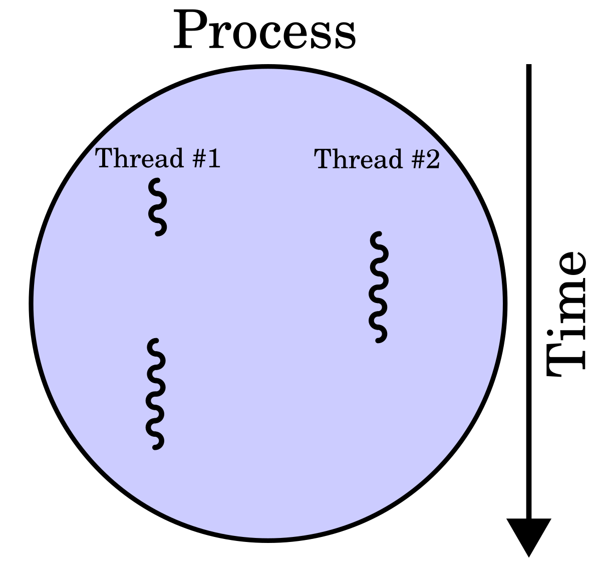

## Kernel Rootkit - Malicious Kernel Mode Driver - Threading

<p align="center">
	
</p>


---
---
---


## 📑 Table of Contents

* [Windows Kernel-Mode Process and Thread Manager](#overview)
* [General Description](#general-description)
* [Source Code](#source-code)
* [Installation](#installation)
* [Tools](#Tools)
* [Files](#Files)


---
---
---


<div id='overview'/>

### 🧐 Windows Kernel-Mode Process and Thread Manager

A process is a software program that is currently running in Windows. Every process has an ID, a number that identifies it. A thread is an object that identifies which part of the program is running. Each thread has an ID, a number that identifies it.

A process may have more than one thread. The purpose of a thread is to allocate processor time. On a machine with one processor, more than one thread can be allocated, but only one thread can run at a time. Each thread only runs a short time and then the execution is passed on to the next thread, giving the user the illusion that more than one thing is happening at once. On a machine with more than one processor, true multi-threading can take place. If an application has multiple threads, the threads can run simultaneously on different processors.

The Windows kernel-mode process and thread manager handles the execution of all threads in a process. Whether you have one processor or more, great care must be taken in driver programming to make sure that all threads of your process are designed so that no matter what order the threads are handled, your driver will operate properly.

If threads from different processes attempt to use the same resource at the same time, problems can occur. Windows provides several techniques to avoid this problem. The technique of making sure that threads from different processes do not touch the same resource is called synchronization.

Routines that provide a direct interface to the process and thread manager are usually prefixed with the letters "Ps"; for example, PsCreateSystemThread.

[~ Microsoft - Windows Kernel-Mode Process and Thread Manager](https://learn.microsoft.com/en-us/windows-hardware/drivers/kernel/windows-kernel-mode-process-and-thread-manager)


---
---
---


<div id='installation'/>

### ⚙️ Installation

1. **Create a New Kernel Mode Driver Project**
	- Open [Visual Studio](https://visualstudio.microsoft.com/vs/community/).
	- Create a new project:
		- Click 'Create a new project'.
		- Search for templates (Alt + S) and select 'Kernel Mode Driver, Empty (KMDF)'.
		- Click 'Next'.
	- Enter the project name as 'KMDFDriver_Threading', the solution name as 'KernelRootkit002_Threading', and click 'Create'.

2. **Add Source Code**
	- In the Solution Explorer, navigate to 'Source Files'.
	- Right-click on 'Source Files -> Add -> New Item...'.
	- Select 'C++ File (.cpp)' and name it 'Driver.c'.
	- Paste the driver source code into that file.

3. **Set the Build Configuration**
	- In the toolbar, set the configuration to 'Release' and 'x64'.

4. **Build the Solution**
	- Go to 'Build -> Build Solution' or press 'Ctrl + Shift + B'.
	- If the build succeeds, locate the compiled '.sys' driver file at:
		```
		C:\Users\%USERNAME%\source\repos\KernelRootkit002_Threading\x64\Release\KMDFDriver_Threading.sys
		```

5. **Prepare the Virtual Machine**
	- Use [VMware Workstation](https://www.vmware.com/products/desktop-hypervisor/workstation-and-fusion) or [VirtualBox](https://www.virtualbox.org/) to start your virtual machine (e.g., MalwareWindows11).
	- Copy the driver file ('KMDFDriver_Threading.sys') to the virtual machine's 'C:\Users\%USERNAME%\Downloads\' directory.

6. **Enable Test Mode in Windows**
	- On the virtual machine, open a Command Prompt (CMD) window as an Administrator and run:
		```
		bcdedit /set testsigning on
		```
	- Restart the virtual machine to apply the changes. After restarting, a "Test Mode" watermark will appear on the desktop, indicating test signing is enabled.
	- Test Mode allows the installation of unsigned drivers by disabling [Driver Signature Enforcement (DSE)](https://learn.microsoft.com/en-us/windows-hardware/drivers/install/driver-signing), which ensures only signed drivers are loaded.

7. **Install the Driver**
	- In the virtual machine, open a CMD window as an Administrator.
	- Navigate to the directory containing the driver ('C:\Users\%USERNAME%\Downloads\').
	- Run the following commands to install the driver:
		```
		sc.exe stop WindowsKernelThreading
		sc.exe delete WindowsKernelThreading
		sc.exe create WindowsKernelThreading type=kernel start=demand binpath="C:\Users\%USERNAME%\Downloads\KMDFDriver_Threading.sys"
		```

8. **Verify Driver Installation**
	- Open [Autoruns](https://learn.microsoft.com/en-us/sysinternals/downloads/autoruns) as Administrator.
	- Navigate to the Drivers tab.
	- Look for the service WindowsKernelThreading in the list.
	- Ensure that the path matches the one used during the sc.exe create command.
	- This step confirms that the driver is correctly registered in the system.

9. **Monitor Driver Messages**
	- Open [DebugView](https://docs.microsoft.com/en-us/sysinternals/downloads/debugview) as an Administrator.
	- Enable the following options:
		- 'Capture -> Capture Kernel'
		- 'Capture -> Enable Verbose Kernel Output'
	- Close DebugView and reopen it as Administrator to ensure proper functionality. This step helps avoid issues with message capture, which can occur the first time these options are enabled.

10. **Start the Driver**
	- Run the following command in the CMD window as an Administrator:
		```
		sc.exe start WindowsKernelThreading
		```
	- Observe debug messages in DebugView to verify the driver's functionality.

11. **Verify Functionality**
	- Depending on the driver's purpose, perform tests to confirm it works as expected. Examples include observing process creation logs, testing filesystem filters, or interacting with specific driver behavior.

12. **Remove the Driver**
	- To stop and remove the driver after testing, run the following commands in a CMD window as an Administrator:
		```
		sc.exe stop WindowsKernelThreading
		sc.exe delete WindowsKernelThreading
		```

13. **Disable Test Mode (Optional)**
	- After testing, you can disable Test Mode by running:
		```
		bcdedit /set testsigning off
		```
	- Restart the virtual machine to apply the changes.


---
---
---


<div id='tools'/>

### 🛠️ Tools

* [Visual Studio Community](https://visualstudio.microsoft.com/vs/community/)
* [Windows Software Development Kit (SDK)](https://developer.microsoft.com/en-us/windows/downloads/windows-sdk/)
* [Windows Driver Kit (WDK)](https://learn.microsoft.com/en-us/windows-hardware/drivers/download-the-wdk)
* [Sysinternals Suite](https://learn.microsoft.com/en-us/sysinternals/downloads/sysinternals-suite)
* [DebugView](https://learn.microsoft.com/en-us/sysinternals/downloads/debugview)
* [Autoruns](https://learn.microsoft.com/en-us/sysinternals/downloads/autoruns)


---
---
---


<div id='files'/>

### 📂 Files

```
├───KernelRootkit002_Threading
	|
	├───KMDFDriver_Threading
	|		Driver.c
	│
	└───README.md
```
