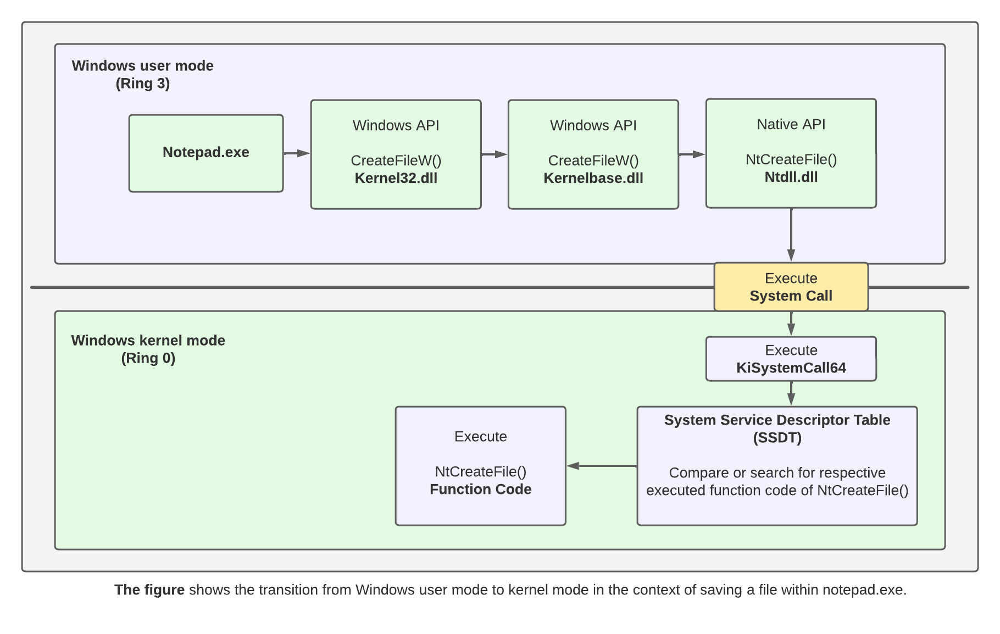

## Kernel Rootkit - Malicious Kernel Mode Driver - Zw Functions

<p align="center">
	
</p>


---
---
---


## 📑 Table of Contents

* [What Does the Zw Prefix Mean?](#overview)
* [Installation](#installation)
* [Tools](#Tools)
* [Files](#Files)


---
---
---


<div id='overview'/>

### 🧐 What Does the Zw Prefix Mean?

The Windows native system services routines have names that begin with the prefixes Nt and Zw. The Nt prefix is an abbreviation of Windows NT, but the Zw prefix has no meaning. Zw was selected partly to avoid potential naming conflicts with other APIs, and partly to avoid using any potentially useful two-letter prefixes that might be needed in the future.

Many of the Windows driver support routines have names that begin with two- or three-letter prefixes. These prefixes indicate which kernel-mode system components implement the routines. The following table contains some examples.

| **Prefix** | **Kernel Component**             | **Example Routine**           |
|------------|----------------------------------|-------------------------------|
| Cm         | Configuration Manager            | CmRegisterCallbackEx          |
| Ex         | Executive                        | ExAllocatePool                |
| Hal        | Hardware Abstraction Layer       | HalGetAdapter                 |
| Io         | I/O Manager                      | IoAllocateIrp                 |
| Ke         | Kernel Core                      | KeSetEvent                    |
| Mm         | Memory Manager                   | MmUnlockPages                 |
| Ob         | Object Manager                   | ObReferenceObject             |
| Po         | Power Manager                    | PoSetPowerState               |
| Tm         | Transaction Manager              | TmCommitTransaction           |
| Nt and Zw  | Native System Services           | NtCreateFile and ZwCreateFile |


[~ Microsoft - What Does the Zw Prefix Mean?](https://learn.microsoft.com/en-us/windows-hardware/drivers/kernel/what-does-the-zw-prefix-mean-)


---
---
---


<div id='installation'/>

### ⚙️ Installation

1. **Create a New Kernel Mode Driver Project**
	- Open [Visual Studio](https://visualstudio.microsoft.com/vs/community/).
	- Create a new project:
		- Click 'Create a new project'.
		- Search for templates (Alt + S) and select 'Kernel Mode Driver, Empty (KMDF)'.
		- Click 'Next'.
	- Enter the project name as 'KMDFDriver_ZwFunctions', the solution name as 'KernelRootkit003_ZwFunctions', and click 'Create'.

2. **Add Source Code**
	- In the Solution Explorer, navigate to 'Source Files'.
	- Right-click on 'Source Files -> Add -> New Item...'.
	- Select 'C++ File (.cpp)' and name it 'Driver.c'.
	- Paste the driver source code into that file.

3. **Set the Build Configuration**
	- In the toolbar, set the configuration to 'Release' and 'x64'.

4. **Build the Solution**
	- Go to 'Build -> Build Solution' or press 'Ctrl + Shift + B'.
	- If the build succeeds, locate the compiled '.sys' driver file at:
		```
		C:\Users\%USERNAME%\source\repos\KernelRootkit003_ZwFunctions\x64\Release\KMDFDriver_ZwFunctions.sys
		```

5. **Prepare the Virtual Machine**
	- Use [VMware Workstation](https://www.vmware.com/products/desktop-hypervisor/workstation-and-fusion) or [VirtualBox](https://www.virtualbox.org/) to start your virtual machine (e.g., MalwareWindows11).
	- Copy the driver file ('KMDFDriver_ZwFunctions.sys') to the virtual machine's 'C:\Users\%USERNAME%\Downloads\' directory.

6. **Enable Test Mode in Windows**
	- On the virtual machine, open a Command Prompt (CMD) window as an Administrator and run:
		```
		bcdedit /set testsigning on
		```
	- Restart the virtual machine to apply the changes. After restarting, a "Test Mode" watermark will appear on the desktop, indicating test signing is enabled.
	- Test Mode allows the installation of unsigned drivers by disabling [Driver Signature Enforcement (DSE)](https://learn.microsoft.com/en-us/windows-hardware/drivers/install/driver-signing), which ensures only signed drivers are loaded.

7. **Install the Driver**
	- In the virtual machine, open a CMD window as an Administrator.
	- Navigate to the directory containing the driver ('C:\Users\%USERNAME%\Downloads\').
	- Run the following commands to install the driver:
		```
		sc.exe stop WindowsKernelZwFunctions
		sc.exe delete WindowsKernelZwFunctions
		sc.exe create WindowsKernelZwFunctions type=kernel start=demand binpath="C:\Users\%USERNAME%\Downloads\KMDFDriver_ZwFunctions.sys"
		```

8. **Verify Driver Installation**
	- Open [Autoruns](https://learn.microsoft.com/en-us/sysinternals/downloads/autoruns) as Administrator.
	- Navigate to the Drivers tab.
	- Look for the seervice WindowsKernelZwFunctions in the list.
	- Ensure that the path matches the one used during the sc.exe create command.
	- This step confirms that the driver is correctly registered in the system.

9. **Monitor Driver Messages**
	- Open [DebugView](https://docs.microsoft.com/en-us/sysinternals/downloads/debugview) as an Administrator.
	- Enable the following options:
		- 'Capture -> Capture Kernel'
		- 'Capture -> Enable Verbose Kernel Output'
	- Close DebugView and reopen it as Administrator to ensure proper functionality. This step helps avoid issues with message capture, which can occur the first time these options are enabled.

10. **Start the Driver**
	- Run the following command in the CMD window as an Administrator:
		```
		sc.exe start WindowsKernelZwFunctions
		```
	- Observe debug messages in DebugView to verify the driver's functionality.

11. **Verify Functionality**
	- Depending on the driver's purpose, perform tests to confirm it works as expected. Examples include observing process creation logs, testing filesystem filters, or interacting with specific driver behavior.

12. **Remove the Driver**
	- To stop and remove the driver after testing, run the following commands in a CMD window as an Administrator:
		```
		sc.exe stop WindowsKernelZwFunctions
		sc.exe delete WindowsKernelZwFunctions
		```

13. **Disable Test Mode (Optional)**
	- After testing, you can disable Test Mode by running:
		```
		bcdedit /set testsigning off
		```
	- Restart the virtual machine to apply the changes.


---
---
---


<div id='tools'/>

### 🛠️ Tools

* [Visual Studio Community](https://visualstudio.microsoft.com/vs/community/)
* [Windows Software Development Kit (SDK)](https://developer.microsoft.com/en-us/windows/downloads/windows-sdk/)
* [Windows Driver Kit (WDK)](https://learn.microsoft.com/en-us/windows-hardware/drivers/download-the-wdk)
* [Sysinternals Suite](https://learn.microsoft.com/en-us/sysinternals/downloads/sysinternals-suite)
* [DebugView](https://learn.microsoft.com/en-us/sysinternals/downloads/debugview)
* [Autoruns](https://learn.microsoft.com/en-us/sysinternals/downloads/autoruns)


---
---
---


<div id='files'/>

### 📂 Files

```
├───KernelRootkit003_ZwFunctions
	|
	├───KMDFDriver_ZwFunctions
	|		Driver.c
	│
	└───README.md
```
