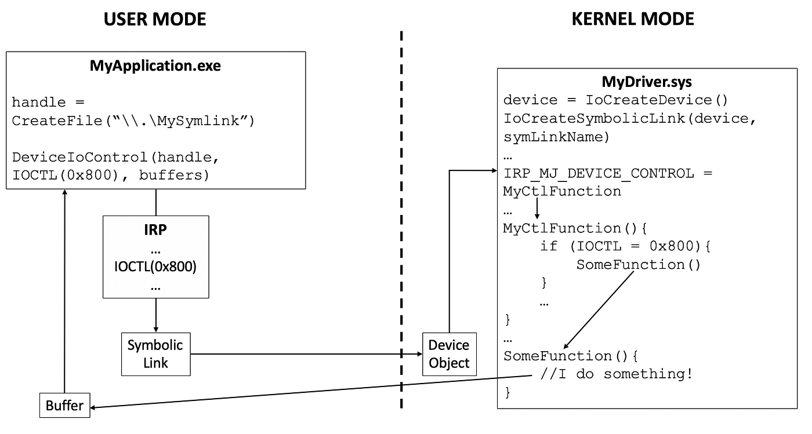

## Kernel Rootkit - Malicious Kernel Mode Driver - IOCTLs

<p align="center">
	
</p>


---
---
---


## 📑 Table of Contents

* [Introduction to I/O Control Codes](#overview)
* [Installation](#installation)
* [Tools](#Tools)
* [Files](#Files)


---
---
---


<div id='overview'/>

### 🧐 Introduction to I/O Control Codes

I/O control codes (IOCTLs) are used for communication between user-mode applications and drivers, or for communication internally among drivers in a stack. I/O control codes are sent using IRPs.

User-mode applications send IOCTLs to drivers by calling DeviceIoControl, which is described in Microsoft Windows SDK documentation. Calls to DeviceIoControl cause the I/O manager to create an IRP_MJ_DEVICE_CONTROL request and send it to the topmost driver.

Additionally, upper-level drivers can send IOCTLs to lower-level drivers by creating and sending IRP_MJ_DEVICE_CONTROL or IRP_MJ_INTERNAL_DEVICE_CONTROL requests. Drivers process these requests in DispatchDeviceControl and DispatchInternalDeviceControl routines. (User-mode applications cannot send IRP_MJ_INTERNAL_DEVICE_CONTROL requests.)

Some IOCTLs are "public" and some are "private". Public IOCTLs are typically system-defined and documented by Microsoft, in either the Windows Driver Kit (WDK) or the Windows SDK. They might be sent by means of a user-mode component's calls to DeviceIoControl, or they might be sent from one kernel-mode driver to another, using IRP_MJ_DEVICE_CONTROL or IRP_MJ_INTERNAL_DEVICE_CONTROL requests. Examples of public IOCTLs include SCSI Port I/O Control Codes and I8042prt Mouse Internal Device Control Requests.

Private IOCTLs, on the other hand, are meant to be used exclusively by a vendor's software components to communicate with each other. Private IOCTLs are typically defined in a vendor-supplied header file and are not publicly documented. Like public IOCTLs, they might be sent by means of a user-mode component's calls to DeviceIoControl, or they might be sent from one kernel-mode driver to another, using IRP_MJ_DEVICE_CONTROL or IRP_MJ_INTERNAL_DEVICE_CONTROL requests.

There is no difference between the coding of public and private IOCTLs. There are, however, differences in the internal codes that can be used in vendor-defined IOCTLs, compared with those that are used for system-defined IOCTLs. If the available public IOCTLs do not fit your needs, you can define new private IOCTLs that your software components can use to communicate with one another.

[~ Microsoft - Introduction to I/O Control Codes](https://learn.microsoft.com/en-us/windows-hardware/drivers/kernel/introduction-to-i-o-control-codes)


---
---
---


<div id='installation'/>

### ⚙️ Installation

1. **Create a New Kernel Mode Driver Project**
	- Open [Visual Studio](https://visualstudio.microsoft.com/vs/community/).
	- Create a new project:
		- Click 'Create a new project'.
		- Search for templates (Alt + S) and select 'Kernel Mode Driver, Empty (KMDF)'.
		- Click 'Next'.
	- Enter the project name as 'KMDFDriver_IOCTLs', the solution name as 'KernelRootkit004_IOCTLs', and click 'Create'.

2. **Add Source Code**
	- In the Solution Explorer, navigate to 'Source Files'.
	- Right-click on 'Source Files -> Add -> New Item...'.
	- Select 'C++ File (.cpp)' and name it 'Driver.c'.
	- Paste the driver source code into that file.

3. **Set the Build Configuration**
	- In the toolbar, set the configuration to 'Release' and 'x64'.

4. **Build the Solution**
	- Go to 'Build -> Build Solution' or press 'Ctrl + Shift + B'.
	- If the build succeeds, locate the compiled '.sys' driver file at:
		```
		C:\Users\%USERNAME%\source\repos\KernelRootkit004_IOCTLs\x64\Release\KMDFDriver_IOCTLs.sys
		```

5. **Add a Console Application Project to the Solution**
	- Add a new project:
		- In the Solution Explorer, right-click on the Solution and select 'Add -> New Project...'.
		- Search for templates (Alt + S) and select 'Console App'.
		- Click 'Next'.
	- Enter the project name as 'ConsoleApp_IOCTLs', and click 'Create'.

6. **Add Source Code**
	- In the Solution Explorer, navigate to 'Source Files'.
	- Find the default file 'ConsoleApp_IOCTLs.cpp' and change the name to 'Application.c'.
	- Paste the application source code into that file.

7. **Build the Solution**
	- Go to 'Build -> Build Solution' or press 'Ctrl + Shift + B'.
	- If the build succeeds, locate the compiled '.sys' driver file and the compiled '.exe' application file at:
		```
		C:\Users\%USERNAME%\source\repos\KernelRootkit004_IOCTLs\x64\Release\KMDFDriver_IOCTLs.sys
		C:\Users\%USERNAME%\source\repos\KernelRootkit004_IOCTLs\x64\Release\ConsoleApp_IOCTLs.exe
		```

8. **Prepare the Virtual Machine**
	- Use [VMware Workstation](https://www.vmware.com/products/desktop-hypervisor/workstation-and-fusion) or [VirtualBox](https://www.virtualbox.org/) to start your virtual machine (e.g., MalwareWindows11).
	- Copy the driver file ('KMDFDriver_IOCTLs.sys') to the virtual machine's 'C:\Users\%USERNAME%\Downloads\' directory.
	- Copy the application executable ('ConsoleApp_IOCTLs.exe') to the virtual machine's 'C:\Users\%USERNAME%\Downloads\' directory.

9. **Enable Test Mode in Windows**
	- On the virtual machine, open a Command Prompt (CMD) window as an Administrator and run:
		```
		bcdedit /set testsigning on
		```
	- Restart the virtual machine to apply the changes. After restarting, a "Test Mode" watermark will appear on the desktop, indicating test signing is enabled.
	- Test Mode allows the installation of unsigned drivers by disabling [Driver Signature Enforcement (DSE)](https://learn.microsoft.com/en-us/windows-hardware/drivers/install/driver-signing), which ensures only signed drivers are loaded.

10. **Install the Driver**
	- In the virtual machine, open a CMD window as an Administrator.
	- Navigate to the directory containing the driver ('C:\Users\%USERNAME%\Downloads\').
	- Run the following commands to install the driver:
		```
		sc.exe stop WindowsKernelIOCTLs
		sc.exe delete WindowsKernelIOCTLs
		sc.exe create WindowsKernelIOCTLs type=kernel start=demand binpath="C:\Users\%USERNAME%\Downloads\KMDFDriver_DKOM.sys"
		```

11. **Verify Driver Installation**
	- Open [Autoruns](https://learn.microsoft.com/en-us/sysinternals/downloads/autoruns) as Administrator.
	- Navigate to the Drivers tab.
	- Look for the driver WindowsKernelIOCTLs.sys in the list.
	- Ensure that the path matches the one used during the sc.exe create command.
	- This step confirms that the driver is correctly registered in the system.

12. **Monitor Driver Messages**
	- Open [DebugView](https://docs.microsoft.com/en-us/sysinternals/downloads/debugview) as an Administrator.
	- Enable the following options:
		- 'Capture -> Capture Kernel'
		- 'Capture -> Enable Verbose Kernel Output'
	- Close DebugView and reopen it as Administrator to ensure proper functionality. This step helps avoid issues with message capture, which can occur the first time these options are enabled.

13. **Start the Driver**
	- Run the following command in the CMD window as an Administrator:
		```
		sc.exe start WindowsKernelIOCTLs
		```
	- Observe debug messages in DebugView to verify the driver's functionality.

14. **Run the Application**
	- Execute the application by running:
	```
	ConsoleApp_IOCTLs.exe
	```
	- Ensure that the driver is installed and running before executing the application. If the driver is not active, the application will display an error and fail to execute.

15. **Verify Application Communication**
	- Confirm that the application successfully communicates with the kernel-mode driver. Observe DebugView for messages and verify driver interaction.

16. **Remove the Driver**
	- To stop and remove the driver after testing, run the following commands in a CMD window as an Administrator:
		```
		sc.exe stop WindowsKernelIOCTLs
		sc.exe delete WindowsKernelIOCTLs
		```

17. **Disable Test Mode (Optional)**
	- After testing, you can disable Test Mode by running:
		```
		bcdedit /set testsigning off
		```
	- Restart the virtual machine to apply the changes.


---
---
---


<div id='tools'/>

### 🛠️ Tools

* [Visual Studio Community](https://visualstudio.microsoft.com/vs/community/)
* [Windows Software Development Kit (SDK)](https://developer.microsoft.com/en-us/windows/downloads/windows-sdk/)
* [Windows Driver Kit (WDK)](https://learn.microsoft.com/en-us/windows-hardware/drivers/download-the-wdk)
* [DebugView](https://learn.microsoft.com/en-us/sysinternals/downloads/debugview)
* [Autoruns](https://learn.microsoft.com/en-us/sysinternals/downloads/autoruns)


---
---
---


<div id='files'/>

### 📂 Files

```
├───KernelRootkit004_IOCTLs
	|
	├───ConsoleApp_IOCTLs
	│		Application.c
	|
	├───KMDFDriver_IOCTLs
	|		Driver.c
	│
	└───README.md
```
