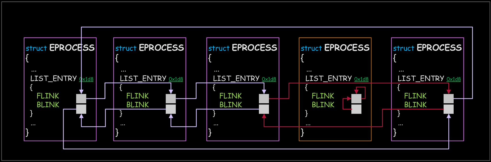

## Kernel Rootkit - Malicious Kernel Mode Driver - Direct Kernel Object Manipulation (DKOM)

<p align="center">
	
</p>


---
---
---


## 📑 Table of Contents

* [Direct Kernel Object Manipulation](#overview)
* [Installation](#installation)
* [Tools](#Tools)
* [Files](#Files)


---
---
---


<div id='overview'/>

### 🧐 Direct Kernel Object Manipulation

Direct kernel object manipulation (DKOM) is a common rootkit technique for Microsoft Windows to hide potentially damaging third-party processes, drivers, files, and intermediate connections from the task manager and event scheduler.

At its very core, a rootkit that employs DKOM hides itself from the Object Manager or Task manager. By modifying the linked list containing a list of all active threads and processes, this type of rootkit can essentially hide all traces from the Object Manager by wrapping the pointer away from the rootkit itself. This is possible due to the fact that kernel modules and loadable drivers have direct access to the kernel memory from its privileged access. When the system kernel pings to find the list of all processes running in the system, it relies on the EPROCESS to find them. However, because a Windows Kernel is thread based and not process based, pointers can be freely modified without any unintended effects. By modifying linked list pointers to wrap around the rootkit process itself, the rootkit becomes invisible to the Windows event viewer and any system integrity applications that rely on this list. This allows DKOM rootkits to have free rein over the targeted system.

Each process is represented as an object and is interconnected with one another in the operating system. Within each process, there is a pre-allocated set of space that contains the address of the current, next, and mutex_locked thread. This vital information is listed in the EPROCESS in memory; the section in the object manager contains a double linked list of all known processes running, which is also known as the EPROCESS. However, DKOM's take advantage of this structure by modifying the front link (FLINK) to point to the previous node of the processor that we want to hide, and pointing the back link (BLINK) of the hidden processor to the previous structure. By modifying a subsection of the EPROCESS block, the list of currently active processes points around the hidden process. This essentially hides any paper trail of a given process or injector from the scrutiny of the scheduler because the process is hidden; yet it runs indefinitely because the thread it is in is active due to the round-robin policy.

The main issue with this type of rootkit is that hidden processes are still able to run despite various context switches. In a Windows scheduler, threads are segregated to perform tasks, not processes. Rather, a thread calls multiple processes during a given time frame. This process is controlled by the round-robin nature of the scheduler and threads are put on idle to allow other threads to be active. Even though a process becomes invisible to the task manager, the process still runs concurrently with the system because the threads are active. This makes detecting hidden processes created by the rootkit extremely difficult. 

[~ Wikipedia - Direct kernel object manipulation](https://en.wikipedia.org/wiki/Direct_kernel_object_manipulation)


---
---
---


<div id='installation'/>

### ⚙️ Installation

1. **Create a New Kernel Mode Driver Project**
	- Open [Visual Studio](https://visualstudio.microsoft.com/vs/community/).
	- Create a new project:
		- Click 'Create a new project'.
		- Search for templates (Alt + S) and select 'Kernel Mode Driver, Empty (KMDF)'.
		- Click 'Next'.
	- Enter the project name as 'KMDFDriver_DKOM', the solution name as 'KernelRootkit006_DKOM', and click 'Create'.

2. **Add Source Code**
	- In the Solution Explorer, navigate to 'Source Files'.
	- Right-click on 'Source Files -> Add -> New Item...'.
	- Select 'C++ File (.cpp)' and name it 'Driver.c'.
	- Paste the driver source code into that file.

3. **Set the Build Configuration**
	- In the toolbar, set the configuration to 'Release' and 'x64'.

4. **Build the Solution**
	- Go to 'Build -> Build Solution' or press 'Ctrl + Shift + B'.
	- If the build succeeds, locate the compiled '.sys' driver file at:
		```
		C:\Users\%USERNAME%\source\repos\KernelRootkit006_DKOM\x64\Release\KMDFDriver_DKOM.sys
		```

5. **Add a Console Application Project to the Solution**
	- Add a new project:
		- In the Solution Explorer, right-click on the Solution and select 'Add -> New Project...'.
		- Search for templates (Alt + S) and select 'Console App'.
		- Click 'Next'.
	- Enter the project name as 'ConsoleApp_DKOM', and click 'Create'.

6. **Add Source Code**
	- In the Solution Explorer, navigate to 'Source Files'.
	- Find the default file 'ConsoleApp_DKOM.cpp' and change the name to 'Application.c'.
	- Paste the application source code into that file.

7. **Build the Solution**
	- Go to 'Build -> Build Solution' or press 'Ctrl + Shift + B'.
	- If the build succeeds, locate the compiled '.sys' driver file and the compiled '.exe' application file at:
		```
		C:\Users\%USERNAME%\source\repos\KernelRootkit006_DKOM\x64\Release\KMDFDriver_DKOM.sys
		C:\Users\%USERNAME%\source\repos\KernelRootkit006_DKOM\x64\Release\ConsoleApp_DKOM.exe
		```

8. **Prepare the Virtual Machine**
	- Use [VMware Workstation](https://www.vmware.com/products/desktop-hypervisor/workstation-and-fusion) or [VirtualBox](https://www.virtualbox.org/) to start your virtual machine (e.g., MalwareWindows11).
	- Copy the driver file ('KMDFDriver_DKOM.sys') to the virtual machine's 'C:\Users\%USERNAME%\Downloads\' directory.
	- Copy the application executable ('ConsoleApp_DKOM.exe') to the virtual machine's 'C:\Users\%USERNAME%\Downloads\' directory.

9. **Enable Test Mode in Windows**
	- On the virtual machine, open a Command Prompt (CMD) window as an Administrator and run:
		```
		bcdedit /set testsigning on
		```
	- Restart the virtual machine to apply the changes. After restarting, a "Test Mode" watermark will appear on the desktop, indicating test signing is enabled.
	- Test Mode allows the installation of unsigned drivers by disabling [Driver Signature Enforcement (DSE)](https://learn.microsoft.com/en-us/windows-hardware/drivers/install/driver-signing), which ensures only signed drivers are loaded.

10. **Install the Driver**
	- In the virtual machine, open a CMD window as an Administrator.
	- Navigate to the directory containing the driver ('C:\Users\%USERNAME%\Downloads\').
	- Run the following commands to install the driver:
		```
		sc.exe stop WindowsKernelDKOM
		sc.exe delete WindowsKernelDKOM
		sc.exe create WindowsKernelDKOM type=kernel start=demand binpath="C:\Users\%USERNAME%\Downloads\KMDFDriver_DKOM.sys"
		```

11. **Verify Driver Installation**
	- Open [Autoruns](https://learn.microsoft.com/en-us/sysinternals/downloads/autoruns) as Administrator.
	- Navigate to the Drivers tab.
	- Look for the driver WindowsKernelDKOM.sys in the list.
	- Ensure that the path matches the one used during the sc.exe create command.
	- This step confirms that the driver is correctly registered in the system.

12. **Monitor Driver Messages**
	- Open [DebugView](https://docs.microsoft.com/en-us/sysinternals/downloads/debugview) as an Administrator.
	- Enable the following options:
		- 'Capture -> Capture Kernel'
		- 'Capture -> Enable Verbose Kernel Output'
	- Close DebugView and reopen it as Administrator to ensure proper functionality. This step helps avoid issues with message capture, which can occur the first time these options are enabled.

13. **Start the Driver**
	- Run the following command in the CMD window as an Administrator:
		```
		sc.exe start WindowsKernelDKOM
		```
	- Observe debug messages in DebugView to verify the driver's functionality.

14. **Run the Application**
	- Execute the application by running:
	```
	ConsoleApp_DKOM.exe
	```
	- Ensure that the driver is installed and running before executing the application. If the driver is not active, the application will display an error and fail to execute.

15. **Verify Application Communication**
	- Confirm that the application successfully communicates with the kernel-mode driver. Observe DebugView for messages and verify driver interaction.

16. **Remove the Driver**
	- To stop and remove the driver after testing, run the following commands in a CMD window as an Administrator:
		```
		sc.exe stop WindowsKernelDKOM
		sc.exe delete WindowsKernelDKOM
		```

17. **Disable Test Mode (Optional)**
	- After testing, you can disable Test Mode by running:
		```
		bcdedit /set testsigning off
		```
	- Restart the virtual machine to apply the changes.


---
---
---


<div id='tools'/>

### 🛠️ Tools

* [Visual Studio Community](https://visualstudio.microsoft.com/vs/community/)
* [Windows Software Development Kit (SDK)](https://developer.microsoft.com/en-us/windows/downloads/windows-sdk/)
* [Windows Driver Kit (WDK)](https://learn.microsoft.com/en-us/windows-hardware/drivers/download-the-wdk)
* [DebugView](https://learn.microsoft.com/en-us/sysinternals/downloads/debugview)
* [Autoruns](https://learn.microsoft.com/en-us/sysinternals/downloads/autoruns)


---
---
---


<div id='files'/>

### 📂 Files

```
├───KernelRootkit006_DKOM
	|
	├───ConsoleApp_DKOM
	│		Application.c
	|
	├───KMDFDriver_DKOM
	|		Driver.c
	│
	└───README.md
```
