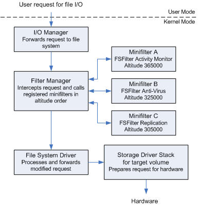

## Kernel Rootkit - Malicious Kernel Mode Driver - IOCTLs

<p align="center">
	
</p>


---
---
---


## 📑 Table of Contents

* [Filter Manager Concepts](#overview)
* [Installation](#installation)
* [Tools](#Tools)
* [Files](#Files)


---
---
---


<div id='overview'/>

### 🧐 Filter Manager Concepts

The Filter Manager (FltMgr.sys) is a system-supplied kernel-mode driver that implements and exposes functionality commonly required in file system filter drivers. File system filter developers can use FltMgr's functionality to write minifilter drivers that are simpler to develop than legacy file system filter drivers. The end result is a shortened development process and higher-quality, more robust drivers.

FltMgr is installed with Windows, but becomes active only when a minifilter driver is loaded. It attaches to the file system stack for a target volume. A minifilter driver attaches to the file system stack indirectly, by registering with FltMgr for the I/O operations that the minifilter driver chooses to filter.

Minifilters attach in a particular order. The operating system determines the order of attachment by load order groups and altitudes. The attachment of a minifilter driver at a particular altitude on a particular volume is called an instance of the minifilter driver

[~ Microsoft - Filter Manager Concepts](https://learn.microsoft.com/en-us/windows-hardware/drivers/ifs/filter-manager-concepts)


---
---
---


<div id='installation'/>

### ⚙️ Installation

1. **Create a New Kernel Mode Driver Project**
	- Open [Visual Studio](https://visualstudio.microsoft.com/vs/community/).
	- Create a new project:
		- Click 'Create a new project'.
		- Search for templates (Alt + S) and select 'Kernel Mode Driver, Empty (KMDF)'.
		- Click 'Next'.
	- Enter the project name as 'KMDFDriver_Minifilter', the solution name as 'KernelRootkit008_Minifilter', and click 'Create'.

2. **Add Source Code**
	- In the Solution Explorer, navigate to 'Source Files'.
	- Right-click on 'Source Files -> Add -> New Item...'.
	- Select 'C++ File (.cpp)' and name it 'Driver.c'.
	- Paste the driver source code into that file.

3. **Set the Build Configuration**
	- In the toolbar, set the configuration to 'Release' and 'x64'.

4. **Set Library Dependencies**
	- Open Project Properties -> Configuration Properties -> Linker -> Input.
	- In Additional Dependencies, add '$(DDK_LIB_PATH)fltMgr.lib;'
	- Ensure that FltLib.lib is accessible in your SDK or WDK path.

5. **Build the Solution**
	- Go to 'Build -> Build Solution' or press 'Ctrl + Shift + B'.
	- If the build succeeds, locate the compiled '.sys' driver file at:
		```
		C:\Users\%USERNAME%\source\repos\KernelRootkit008_Minifilter\x64\Release\KMDFDriver_Minifilter.sys
		```

6. **Add a Console Application Project to the Solution**
	- Add a new project:
		- In the Solution Explorer, right-click on the Solution and select 'Add -> New Project...'.
		- Search for templates (Alt + S) and select 'Console App'.
		- Click 'Next'.
	- Enter the project name as 'ConsoleApp_MinifilterInstallation', and click 'Create'.

7. **Add Source Code**
	- In the Solution Explorer, navigate to 'Source Files'.
	- Find the default file 'ConsoleApp_MinifilterInstallation.cpp' and change the name to 'Application.c'.
	- Paste the application source code into that file.

8. **Build the Solution**
	- Go to 'Build -> Build Solution' or press 'Ctrl + Shift + B'.
	- If the build succeeds, locate the compiled '.sys' driver file and the compiled '.exe' application file at:
		```
		C:\Users\%USERNAME%\source\repos\KernelRootkit008_Minifilter\x64\Release\KMDFDriver_Minifilter.sys
		C:\Users\%USERNAME%\source\repos\KernelRootkit008_Minifilter\x64\Release\ConsoleApp_MinifilterInstallation.exe
		```

9. **Prepare the Virtual Machine**
	- Use [VMware Workstation](https://www.vmware.com/products/desktop-hypervisor/workstation-and-fusion) or [VirtualBox](https://www.virtualbox.org/) to start your virtual machine (e.g., MalwareWindows11).
	- Copy the driver file ('KMDFDriver_Minifilter.sys') to the virtual machine's 'C:\Users\%USERNAME%\Downloads\' directory.
	- Copy the application executable ('ConsoleApp_MinifilterInstallation.exe') to the virtual machine's 'C:\Users\%USERNAME%\Downloads\' directory.

10. **Enable Test Mode in Windows**
	- On the virtual machine, open a Command Prompt (CMD) window as an Administrator and run:
		```
		bcdedit /set testsigning on
		```
	- Restart the virtual machine to apply the changes. After restarting, a "Test Mode" watermark will appear on the desktop, indicating test signing is enabled.
	- Test Mode allows the installation of unsigned drivers by disabling [Driver Signature Enforcement (DSE)](https://learn.microsoft.com/en-us/windows-hardware/drivers/install/driver-signing), which ensures only signed drivers are loaded.

11. **Install the Driver**
	- Option 1: Manual Registration (Using sc.exe)
		- In the virtual machine, open a CMD window as an Administrator.
		- Navigate to the directory containing the driver ('C:\Users\%USERNAME%\Downloads\').
		- Run the following commands to install the driver:
		```
		fltmc unload WindowsKernelMinifilter
		sc.exe delete WindowsKernelMinifilter
		sc.exe create WindowsKernelMinifilter type=filesys start=demand binpath="C:\Users\%USERNAME%\Downloads\KMDFDriver_Minifilter.sys"
		(Start the Driver) fltmc load WindowsKernelMinifilter
		```
		- (If registry setup is needed, run ConsoleApp_MinifilterInstallation.exe afterwards.)
	- Option 2: Using OSR Driver Loader
		- Open OSR Driver Loader.
		- Select KMDFDriver_Minifilter.sys.
		- Set type to MiniFilter -> Click Register Service.
		- (Start the Driver) Click Start Service.
	- Option 3: Auto-Configuration via Driver Entry
		- Uncomment Registry Setup Code inside DriverEntry in KMDFDriver_Minifilter.
		- Recompile & Rebuild the driver.
		- Running the driver will automatically set the required registry keys.
		- Follow the steps from Option 1 to load the driver manually.

12. **Verify Driver Installation**
	- Open [Autoruns](https://learn.microsoft.com/en-us/sysinternals/downloads/autoruns) as Administrator.
	- Navigate to the Drivers tab.
	- Look for the driver WindowsKernelMinifilter.sys in the list.
	- Ensure that the path matches the one used during the sc.exe create command.
	- This step confirms that the driver is correctly registered in the system.

13. **Monitor Driver Messages**
	- Open [DebugView](https://docs.microsoft.com/en-us/sysinternals/downloads/debugview) as an Administrator.
	- Enable the following options:
		- 'Capture -> Capture Kernel'
		- 'Capture -> Enable Verbose Kernel Output'
	- Close DebugView and reopen it as Administrator to ensure proper functionality. This step helps avoid issues with message capture, which can occur the first time these options are enabled.

14. **Start the Driver**
	- Run the following command in the CMD window as an Administrator:
		```
		fltmc load WindowsKernelMinifilter
		```
	- Observe debug messages in DebugView to verify the driver's functionality.

17. **Remove the Driver**
	- To stop and remove the driver after testing, run the following commands in a CMD window as an Administrator:
		```
		fltmc unload WindowsKernelMinifilte
		sc.exe delete WindowsKernelMinifilter
		```

18. **Disable Test Mode (Optional)**
	- After testing, you can disable Test Mode by running:
		```
		bcdedit /set testsigning off
		```
	- Restart the virtual machine to apply the changes.


---
---
---


<div id='tools'/>

### 🛠️ Tools

* [Visual Studio Community](https://visualstudio.microsoft.com/vs/community/)
* [Windows Software Development Kit (SDK)](https://developer.microsoft.com/en-us/windows/downloads/windows-sdk/)
* [Windows Driver Kit (WDK)](https://learn.microsoft.com/en-us/windows-hardware/drivers/download-the-wdk)
* [DebugView](https://learn.microsoft.com/en-us/sysinternals/downloads/debugview)
* [Autoruns](https://learn.microsoft.com/en-us/sysinternals/downloads/autoruns)


---
---
---


<div id='files'/>

### 📂 Files

```
├───KernelRootkit008_Minifilter
	|
	├───ConsoleApp_MinifilterInstallation
	│		Application.c
	|
	├───KMDFDriver_Minifilter
	|		Driver.c
	│
	└───README.md
```
