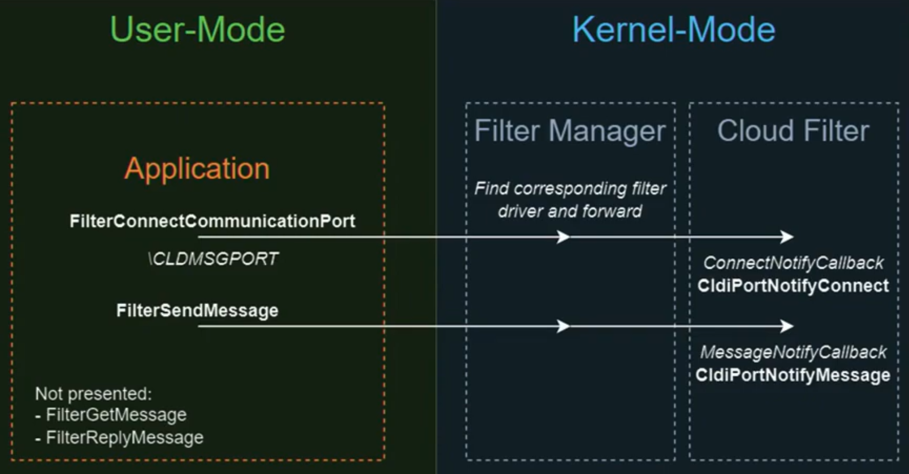

## Kernel Rootkit - Malicious Kernel Mode Driver - Filter Communication Port

<p align="center">
	
</p>


---
---
---


## 📑 Table of Contents

* [Filter Communication Port](#overview)
* [Installation](#installation)
* [Tools](#Tools)
* [Files](#Files)


---
---
---


<div id='overview'/>

### 🧐 Filter Communication Port

Filter Communication Ports provide a structured mechanism for communication between user-mode applications and kernel-mode file system filter drivers. This communication channel is essential for file system monitoring, security applications, and data filtering, enabling controlled interaction between user applications and drivers.

User-mode applications interact with filter drivers through Filter Communication Ports using the function FilterConnectCommunicationPort, allowing them to send messages and receive responses. This API is part of the Filter Manager framework, simplifying driver development and ensuring efficient message exchange.


---
---
---


<div id='installation'/>

### ⚙️ Installation

1. **Create a New Kernel Mode Driver Project**
	- Open [Visual Studio](https://visualstudio.microsoft.com/vs/community/).
	- Create a new project:
		- Click 'Create a new project'.
		- Search for templates (Alt + S) and select 'Kernel Mode Driver, Empty (KMDF)'.
		- Click 'Next'.
	- Enter the project name as 'KMDFDriver_FilterCommunicationPort', the solution name as 'KernelRootkit009_FilterCommunicationPort', and click 'Create'.

2. **Add Source Code**
	- In the Solution Explorer, navigate to 'Source Files'.
	- Right-click on 'Source Files -> Add -> New Item...'.
	- Select 'C++ File (.cpp)' and name it 'Driver.c'.
	- Paste the driver source code into that file.

3. **Set the Build Configuration**
	- In the toolbar, set the configuration to 'Release' and 'x64'.

4. **Set Library Dependencies**
	- Open Project Properties -> Configuration Properties -> Linker -> Input.
	- In Additional Dependencies, add '$(DDK_LIB_PATH)fltMgr.lib;'
	- Ensure that fltMgr.lib is accessible in your SDK or WDK path.

5. **Build the Solution**
	- Go to 'Build -> Build Solution' or press 'Ctrl + Shift + B'.
	- If the build succeeds, locate the compiled '.sys' driver file at:
		```
		C:\Users\%USERNAME%\source\repos\KernelRootkit009_FilterCommunicationPort\x64\Release\KMDFDriver_FilterCommunicationPort.sys
		```

6. **Add a Console Application Project to the Solution**
	- Add a new project:
		- In the Solution Explorer, right-click on the Solution and select 'Add -> New Project...'.
		- Search for templates (Alt + S) and select 'Console App'.
		- Click 'Next'.
	- Enter the project name as 'ConsoleApp_FilterCommunicationPort', and click 'Create'.

7. **Add Source Code**
	- In the Solution Explorer, navigate to 'Source Files'.
	- Find the default file 'ConsoleApp_FilterCommunicationPort.cpp' and change the name to 'Application.c'.
	- Paste the application source code into that file.

8. **Set Library Dependencies**
	- Open Project Properties -> Configuration Properties -> Linker -> Input.
	- In Additional Dependencies, add 'FltLib.lib;'
	- Ensure that FltLib.lib is accessible in your SDK or WDK path.

9. **Build the Solution**
	- Go to 'Build -> Build Solution' or press 'Ctrl + Shift + B'.
	- If the build succeeds, locate the compiled '.sys' driver file and the compiled '.exe' application file at:
		```
		C:\Users\%USERNAME%\source\repos\KernelRootkit009_FilterCommunicationPort\x64\Release\KMDFDriver_FilterCommunicationPort.sys
		C:\Users\%USERNAME%\source\repos\KernelRootkit009_FilterCommunicationPort\x64\Release\ConsoleApp_FilterCommunicationPort.exe
		```

10. **Prepare the Virtual Machine**
	- Use [VMware Workstation](https://www.vmware.com/products/desktop-hypervisor/workstation-and-fusion) or [VirtualBox](https://www.virtualbox.org/) to start your virtual machine (e.g., MalwareWindows11).
	- Copy the driver file ('KMDFDriver_FilterCommunicationPort.sys') to the virtual machine's 'C:\Users\%USERNAME%\Downloads\' directory.
	- Copy the application executable ('ConsoleApp_FilterCommunicationPort.exe') to the virtual machine's 'C:\Users\%USERNAME%\Downloads\' directory.

11. **Enable Test Mode in Windows**
	- On the virtual machine, open a Command Prompt (CMD) window as an Administrator and run:
		```
		bcdedit /set testsigning on
		```
	- Restart the virtual machine to apply the changes. After restarting, a "Test Mode" watermark will appear on the desktop, indicating test signing is enabled.
	- Test Mode allows the installation of unsigned drivers by disabling [Driver Signature Enforcement (DSE)](https://learn.microsoft.com/en-us/windows-hardware/drivers/install/driver-signing), which ensures only signed drivers are loaded.

12. **Install the Driver**
	- In the virtual machine, open a CMD window as an Administrator.
	- Navigate to the directory containing the driver ('C:\Users\%USERNAME%\Downloads\').
	- Run the following commands to install the driver:
		```
		fltmc unload WindowsKernelFilterCommunicationPort
		sc.exe delete WindowsKernelFilterCommunicationPort
		sc.exe create WindowsKernelFilterCommunicationPort type=filesys start=demand binpath="C:\Users\%USERNAME%\Downloads\KMDFDriver_FilterCommunicationPort.sys"
		```

11. **Verify Driver Installation**
	- Open [Autoruns](https://learn.microsoft.com/en-us/sysinternals/downloads/autoruns) as Administrator.
	- Navigate to the Drivers tab.
	- Look for the driver WindowsKernelFilterCommunicationPort.sys in the list.
	- Ensure that the path matches the one used during the sc.exe create command.
	- This step confirms that the driver is correctly registered in the system.

12. **Monitor Driver Messages**
	- Open [DebugView](https://docs.microsoft.com/en-us/sysinternals/downloads/debugview) as an Administrator.
	- Enable the following options:
		- 'Capture -> Capture Kernel'
		- 'Capture -> Enable Verbose Kernel Output'
	- Close DebugView and reopen it as Administrator to ensure proper functionality. This step helps avoid issues with message capture, which can occur the first time these options are enabled.

13. **Start the Driver**
	- Run the following command in the CMD window as an Administrator:
		```
		fltmc load WindowsKernelFilterCommunicationPort
		```
	- Observe debug messages in DebugView to verify the driver's functionality.

14. **Run the Application**
	- Execute the application by running:
	```
	ConsoleApp_FilterCommunicationPort.exe
	```
	- Ensure that the driver is installed and running before executing the application. If the driver is not active, the application will display an error and fail to execute.

15. **Verify Application Communication**
	- Confirm that the application successfully communicates with the kernel-mode driver. Observe DebugView for messages and verify driver interaction.

16. **Remove the Driver**
	- To stop and remove the driver after testing, run the following commands in a CMD window as an Administrator:
		```
		fltmc load WindowsKernelFilterCommunicationPort
		sc.exe delete WindowsKernelFilterCommunicationPort
		```

17. **Disable Test Mode (Optional)**
	- After testing, you can disable Test Mode by running:
		```
		bcdedit /set testsigning off
		```
	- Restart the virtual machine to apply the changes.


---
---
---


<div id='tools'/>

### 🛠️ Tools

* [Visual Studio Community](https://visualstudio.microsoft.com/vs/community/)
* [Windows Software Development Kit (SDK)](https://developer.microsoft.com/en-us/windows/downloads/windows-sdk/)
* [Windows Driver Kit (WDK)](https://learn.microsoft.com/en-us/windows-hardware/drivers/download-the-wdk)
* [DebugView](https://learn.microsoft.com/en-us/sysinternals/downloads/debugview)
* [Autoruns](https://learn.microsoft.com/en-us/sysinternals/downloads/autoruns)


---
---
---


<div id='files'/>

### 📂 Files

```
├───KernelRootkit009_FilterCommunicationPort
	|
	├───ConsoleApp_FilterCommunicationPort
	│		Application.c
	|
	├───KMDFDriver_FilterCommunicationPort
	|		Driver.c
	│
	└───README.md
```
