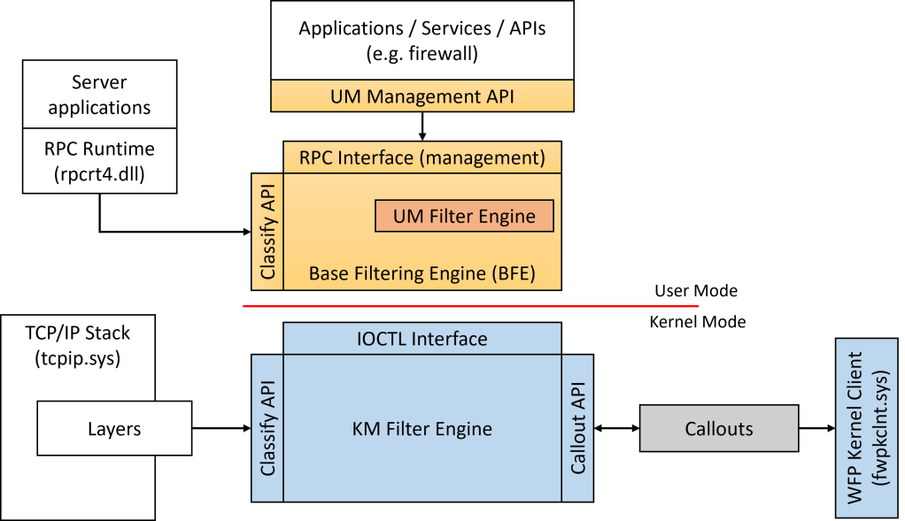

## Kernel Rootkit - Malicious Kernel Mode Driver - Windows Filtering Platform

<p align="center">
	
</p>


---
---
---


## 📑 Table of Contents

* [Windows Filtering Platform](#overview)
* [Installation](#installation)
* [Tools](#Tools)
* [Files](#Files)


---
---
---


<div id='overview'/>

### 🧐 Windows Filtering Platform

Windows Filtering Platform (WFP) is a set of API and system services that provide a platform for creating network filtering applications. The WFP API allows developers to write code that interacts with the packet processing that takes place at several layers in the networking stack of the operating system. Network data can be filtered and also modified before it reaches its destination.

By providing a simpler development platform, WFP is designed to replace previous packet filtering technologies such as Transport Driver Interface (TDI) filters, Network Driver Interface Specification (NDIS) filters, and Winsock Layered Service Providers (LSP). Starting in Windows Server 2008 and Windows Vista, the firewall hook and the filter hook drivers are not available; applications that were using these drivers should use WFP instead.

With the WFP API, developers can implement firewalls, intrusion detection systems, antivirus programs, network monitoring tools, and parental controls. WFP integrates with and provides support for firewall features such as authenticated communication and dynamic firewall configuration based on applications' use of sockets API (application-based policy). WFP also provides infrastructure for IPsec policy management, change notifications, network diagnostics, and stateful filtering.

Windows Filtering Platform is a development platform and not a firewall itself. The firewall application that is built into Windows Vista, Windows Server 2008, and later operating systems Windows Firewall with Advanced Security (WFAS) is implemented using WFP. Therefore, applications developed with the WFP API or the WFAS API use the common filtering arbitration logic that is built into WFP.

The WFP API consists of a user-mode API and a kernel-mode API. This section provides an overview of the entire WFP and describes in detail only the user-mode portion of the WFP API. For a detailed description of the kernel-mode WFP API, see the Windows Driver Kit online help.

[~ Microsoft - Windows Filtering Platform](https://learn.microsoft.com/en-us/windows/win32/fwp/windows-filtering-platform-start-page)


---
---
---


<div id='installation'/>

### ⚙️ Installation

1. **Create a New Kernel Mode Driver Project**
	- Open [Visual Studio](https://visualstudio.microsoft.com/vs/community/).
	- Create a new project: 
		- Click 'Create a new project'.
		- Search for templates (Alt + S) and select 'Kernel Mode Driver, Empty (KMDF)'.
		- Click 'Next'.
	- Enter the project name as 'KMDFDriver_WindowsFilteringPlatform', the solution name as 'KernelRootkit010_WindowsFilteringPlatform', and click 'Create'.

2. **Add Source Code**
	- In the Solution Explorer, navigate to 'Source Files'.
	- Right-click on 'Source Files -> Add -> New Item...'.
	- Select 'C++ File (.cpp)' and name it 'Driver.c'.
	- Paste the driver source code into that file.

3. **Set the Build Configuration**
	- In the toolbar, set the configuration to 'Release' and 'x64'.

4. **Set Library Dependencies**
	- Open Project Properties -> Configuration Properties -> Linker -> Input.
	- In Additional Dependencies, add '$(DDK_LIB_PATH)fwpkclnt.lib;'
	- Ensure that fwpkclnt.lib is accessible in your SDK or WDK path.

5. **Enable NDIS Support**
	- Open Project Properties -> Configuration Properties -> C/C++ -> Preprocessor.
	- In Preprocessor Definitions, add 'NDIS_SUPPORT_NDIS6;'

6. **Build the Solution**
	- Go to 'Build -> Build Solution' or press 'Ctrl + Shift + B'.
	- If the build succeeds, locate the compiled '.sys' driver file at:
		```
		C:\Users\%USERNAME%\source\repos\KernelRootkit010_WindowsFilteringPlatform\x64\Release\KMDFDriver_WindowsFilteringPlatform.sys
		```

7. **Prepare the Virtual Machine**
	- Use [VMware Workstation](https://www.vmware.com/products/desktop-hypervisor/workstation-and-fusion) or [VirtualBox](https://www.virtualbox.org/) to start your virtual machine (e.g., MalwareWindows11).
	- Copy the driver file ('KMDFDriver_WindowsFilteringPlatform.sys') to the virtual machine's 'C:\Users\%USERNAME%\Downloads\' directory.

8. **Enable Test Mode in Windows**
	- On the virtual machine, open a Command Prompt (CMD) window as an Administrator and run:
		```
		bcdedit /set testsigning on
		```
	- Restart the virtual machine to apply the changes. After restarting, a "Test Mode" watermark will appear on the desktop, indicating test signing is enabled.
	- Test Mode allows the installation of unsigned drivers by disabling [Driver Signature Enforcement (DSE)](https://learn.microsoft.com/en-us/windows-hardware/drivers/install/driver-signing), which ensures only signed drivers are loaded.

9. **Install the Driver**
	- In the virtual machine, open a CMD window as an Administrator.
	- Navigate to the directory containing the driver ('C:\Users\%USERNAME%\Downloads\').
	- Run the following commands to install the driver:
		```
		sc.exe stop WindowsKernelWindowsFilteringPlatform
		sc.exe delete WindowsKernelWindowsFilteringPlatform
		sc.exe create WindowsKernelWindowsFilteringPlatform type=kernel start=demand binpath="C:\Users\%USERNAME%\Downloads\KMDFDriver_WindowsFilteringPlatform.sys"
		```

10. **Verify Driver Installation**
	- Open [Autoruns](https://learn.microsoft.com/en-us/sysinternals/downloads/autoruns) as Administrator.
	- Navigate to the Drivers tab.
	- Look for the service WindowsKernelWindowsFilteringPlatform in the list.
	- Ensure that the path matches the one used during the sc.exe create command.
	- This step confirms that the driver is correctly registered in the system.

11. **Monitor Driver Messages**
	- Open [DebugView](https://docs.microsoft.com/en-us/sysinternals/downloads/debugview) as an Administrator.
	- Enable the following options:
		- 'Capture -> Capture Kernel'
		- 'Capture -> Enable Verbose Kernel Output'
	- Close DebugView and reopen it as Administrator to ensure proper functionality. This step helps avoid issues with message capture, which can occur the first time these options are enabled.

12. **Start the Driver**
	- Run the following command in the CMD window as an Administrator:
		```
		sc.exe start WindowsKernelWindowsFilteringPlatform
		```
	- Observe debug messages in DebugView to verify the driver's functionality.

13. **Verify Functionality**
	- Depending on the driver's purpose, perform tests to confirm it works as expected. Examples include observing process creation logs, testing filesystem filters, or interacting with specific driver behavior.

14. **Remove the Driver**
	- To stop and remove the driver after testing, run the following commands in a CMD window as an Administrator:
		```
		sc.exe stop WindowsKernelWindowsFilteringPlatform
		sc.exe delete WindowsKernelWindowsFilteringPlatform
		```

15. **Disable Test Mode (Optional)**
	- After testing, you can disable Test Mode by running:
		```
		bcdedit /set testsigning off
		```
	- Restart the virtual machine to apply the changes.


---
---
---


<div id='tools'/>

### 🛠️ Tools

* [Visual Studio Community](https://visualstudio.microsoft.com/vs/community/)
* [Windows Software Development Kit (SDK)](https://developer.microsoft.com/en-us/windows/downloads/windows-sdk/)
* [Windows Driver Kit (WDK)](https://learn.microsoft.com/en-us/windows-hardware/drivers/download-the-wdk)
* [Sysinternals Suite](https://learn.microsoft.com/en-us/sysinternals/downloads/sysinternals-suite)
* [DebugView](https://learn.microsoft.com/en-us/sysinternals/downloads/debugview)
* [Autoruns](https://learn.microsoft.com/en-us/sysinternals/downloads/autoruns)


---
---
---


<div id='files'/>

### 📂 Files

```
├───KernelRootkit010_WindowsFilteringPlatform
	|
	├───KMDFDriver_WindowsFilteringPlatform
	|		Driver.c
	│
	└───README.md
```
