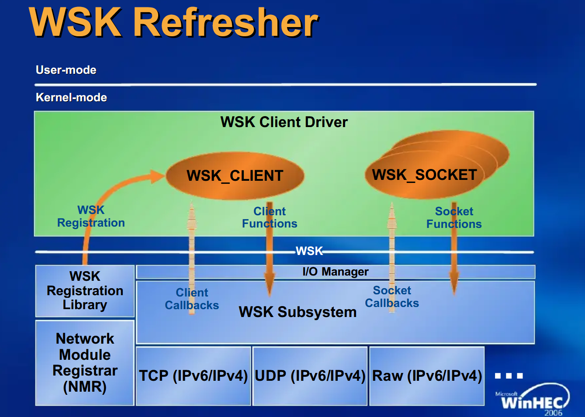

## Kernel Rootkit - Malicious Kernel Mode Driver - WinSock Kernel

<p align="center">
	
</p>


---
---
---


## 📑 Table of Contents

* [Introduction to Winsock Kernel](#overview)
* [Installation](#installation)
* [Tools](#Tools)
* [Files](#Files)


---
---
---


<div id='overview'/>

### 🧐 Introduction to Winsock Kernel

Winsock Kernel (WSK) is a kernel-mode Network Programming Interface (NPI). With WSK, kernel-mode software modules can perform network I/O operations using the same socket programming concepts that are supported by user-mode Winsock2. The WSK NPI supports familiar socket operations such as socket creation, binding, connection establishment, and data transfers (send and receive). However, while WSK NPI supports most of the same socket programming concepts as user-mode Winsock2, WSK NPI is a completely new and different interface with unique characteristics such as asynchronous I/O that uses IRPs and event callbacks to enhance performance.

Kernel-mode network modules targeted for Windows Vista and later versions of Microsoft Windows should use WSK instead of TDI drivers because WSK provides improved performance and easier programming. Filter drivers should implement the Windows Filtering Platform on Windows Vista, and TDI clients should implement WSK.

[~ Microsoft - Introduction to Winsock Kernel](https://learn.microsoft.com/en-us/windows-hardware/drivers/network/introduction-to-winsock-kernel)


---
---
---


<div id='installation'/>

### ⚙️ Installation

1. **Create a New Kernel Mode Driver Project**
	- Open [Visual Studio](https://visualstudio.microsoft.com/vs/community/).
	- Create a new project: 
		- Click 'Create a new project'.
		- Search for templates (Alt + S) and select 'Kernel Mode Driver, Empty (KMDF)'.
		- Click 'Next'.
	- Enter the project name as 'KMDFDriver_WinSockKernel', the solution name as 'KernelRootkit011_WinSockKernel', and click 'Create'.

2. **Add Source Code**
	- In the Solution Explorer, navigate to 'Source Files'.
	- Right-click on 'Source Files -> Add -> New Item...'.
	- Select 'C++ File (.cpp)' and name it 'Driver.c'.
	- Paste the driver source code into that file.

3. **Set the Build Configuration**
	- In the toolbar, set the configuration to 'Release' and 'x64'.

4. **Set Library Dependencies**
	- Open Project Properties -> Configuration Properties -> Linker -> Input.
	- In Additional Dependencies, add '$(DDK_LIB_PATH)Netio.lib;'
	- Ensure that Netio.lib is accessible in your SDK or WDK path.

5. **Consider Creating a Custom Library or Using LibWSK**
	- The WinSock Kernel (WSK) API provides powerful network communication capabilities in kernel mode, but it requires a deep understanding of Windows networking internals.
	- To simplify WSK usage, consider leveraging LibWSK, an open-source library that provides a high-level abstraction over WSK functions.
	- Alternatively, if you want to understand WSK in-depth and build a more customized solution, you can develop your own kernel-mode networking library by studying both LibWSK and KSOCKET implementations.
	- Recommended approach: If you're new to WSK, start with LibWSK to understand its usage. Then, if needed, build your own kernel networking library by studying both LibWSK and KSOCKET.

6. **Build the Solution**
	- Go to 'Build -> Build Solution' or press 'Ctrl + Shift + B'.
	- If the build succeeds, locate the compiled '.sys' driver file at:
		```
		C:\Users\%USERNAME%\source\repos\KernelRootkit011_WinSockKernel\x64\Release\KMDFDriver_WinSockKernel.sys
		```

7. **Prepare the Virtual Machine**
	- Use [VMware Workstation](https://www.vmware.com/products/desktop-hypervisor/workstation-and-fusion) or [VirtualBox](https://www.virtualbox.org/) to start your virtual machine (e.g., MalwareWindows11).
	- Copy the driver file ('KMDFDriver_WinSockKernel.sys') to the virtual machine's 'C:\Users\%USERNAME%\Downloads\' directory.

8. **Enable Test Mode in Windows**
	- On the virtual machine, open a Command Prompt (CMD) window as an Administrator and run:
		```
		bcdedit /set testsigning on
		```
	- Restart the virtual machine to apply the changes. After restarting, a "Test Mode" watermark will appear on the desktop, indicating test signing is enabled.
	- Test Mode allows the installation of unsigned drivers by disabling [Driver Signature Enforcement (DSE)](https://learn.microsoft.com/en-us/windows-hardware/drivers/install/driver-signing), which ensures only signed drivers are loaded.

9. **Install the Driver**
	- In the virtual machine, open a CMD window as an Administrator.
	- Navigate to the directory containing the driver ('C:\Users\%USERNAME%\Downloads\').
	- Run the following commands to install the driver:
		```
		sc.exe stop WindowsKernelWinSockKernel
		sc.exe delete WindowsKernelWinSockKernel
		sc.exe create WindowsKernelWinSockKernel type=kernel start=demand binpath="C:\Users\%USERNAME%\Downloads\KMDFDriver_WinSockKernel.sys"
		```

10. **Verify Driver Installation**
	- Open [Autoruns](https://learn.microsoft.com/en-us/sysinternals/downloads/autoruns) as Administrator.
	- Navigate to the Drivers tab.
	- Look for the service WindowsKernelWinSockKernel in the list.
	- Ensure that the path matches the one used during the sc.exe create command.
	- This step confirms that the driver is correctly registered in the system.

11. **Monitor Driver Messages**
	- Open [DebugView](https://docs.microsoft.com/en-us/sysinternals/downloads/debugview) as an Administrator.
	- Enable the following options:
		- 'Capture -> Capture Kernel'
		- 'Capture -> Enable Verbose Kernel Output'
	- Close DebugView and reopen it as Administrator to ensure proper functionality. This step helps avoid issues with message capture, which can occur the first time these options are enabled.

12. **Start the Driver**
	- Run the following command in the CMD window as an Administrator:
		```
		sc.exe start WindowsKernelWinSockKernel
		```
	- Observe debug messages in DebugView to verify the driver's functionality.

13. **Verify Functionality**
	- Depending on the driver's purpose, perform tests to confirm it works as expected. Examples include observing process creation logs, testing filesystem filters, or interacting with specific driver behavior.

14. **Remove the Driver**
	- To stop and remove the driver after testing, run the following commands in a CMD window as an Administrator:
		```
		sc.exe stop WindowsKernelWinSockKernel
		sc.exe delete WindowsKernelWinSockKernel
		```

15. **Disable Test Mode (Optional)**
	- After testing, you can disable Test Mode by running:
		```
		bcdedit /set testsigning off
		```
	- Restart the virtual machine to apply the changes.


---
---
---


<div id='tools'/>

### 🛠️ Tools

* [Visual Studio Community](https://visualstudio.microsoft.com/vs/community/)
* [Windows Software Development Kit (SDK)](https://developer.microsoft.com/en-us/windows/downloads/windows-sdk/)
* [Windows Driver Kit (WDK)](https://learn.microsoft.com/en-us/windows-hardware/drivers/download-the-wdk)
* [Sysinternals Suite](https://learn.microsoft.com/en-us/sysinternals/downloads/sysinternals-suite)
* [DebugView](https://learn.microsoft.com/en-us/sysinternals/downloads/debugview)
* [Autoruns](https://learn.microsoft.com/en-us/sysinternals/downloads/autoruns)


---
---
---


<div id='files'/>

### 📂 Files

```
├───KernelRootkit011_WinSockKernel
	|
	├───KMDFDriver_WinSockKernel
	|		Driver.c
	│
	└───README.md
```
